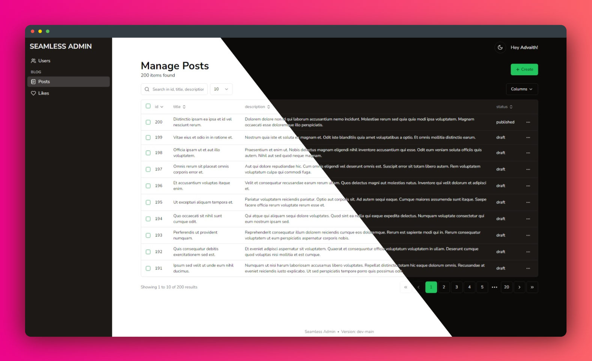

# Seamless Admin Panel

A seamless Django-like admin panel setup for Laravel. Simple, non-cms table manager for admins.

[](https://packagist.org/packages/advaith/seamless-admin)
[](https://packagist.org/packages/advaith/seamless-admin)


## Installation steps

1. Require the Package

Run the following command to install the package into your Laravel application:

```shell
composer require advaith/seamless-admin
```

2. Publish assets and config files with:

```shell
php artisan vendor:publish --provider="Advaith\SeamlessAdmin\SeamlessAdminServiceProvider"
```

This will create a `seamless.php` configuration file within your config folder. This will also publish all the assets
related to this package.

**Note**: If you find the UI or the admin functionalities are not working properly after a `composer update`, run this
command again with the flag `--tag="assets"` to republish the assets. This will override the existing assets with the
new ones.

## Usage

Use the provided trait, `SeamlessAdmin`, in any of your models to get started with the package. Example:

```php
<?php

namespace App\Models;

use Advaith\SeamlessAdmin\Traits\SeamlessAdmin;
...

class Post extends Model
{
    use SeamlessAdmin;
    ...
}
```

Et Voila! That's all you have to do to get started. Visit `/admin` to access the admin dashboard after logging in.



## Configuration

### `seamless-admin.php` config file

- `prefix`: This option can be set to change the prefix of the admin routes. However, this will not change the name of
  the route. By default, `/admin` will be used as the prefix
- `middleware`: Global middleware for the admin routes. By default, the auth middleware is set.

### Model specific configuration

All the model specific configuration should go inside the respective model file.

#### Properties

- `protected $primaryKey`: Primary key of the model will be used even if it is not `id` wherever it is needed.

#### Methods

```php
public function adminIndexFields(): array
```

Admin index page will display all the contents of `protected $fillable`
excluding `protected $hidden` by default. To override this, use the method `adminIndexFields` and return an array of
fields.

```php
public function adminIndexFields(): array
{
    return [
        'title',
        'content'
    ];
}
```

---

```php
public function adminOnCreate(array $fields): array
```

Use the method to change the data saved on create. An example is for Users model:

```php
public function adminOnCreate(array $fields): array
{
    return [
        ...$fields,
        'password' => bcrypt($fields['password'])
    ];
}
```

This method can also be used as a hook as it fires just before the entry is created.

---

```php
public function adminOnEdit(array $fields): array
```

Use the method to change the data saved on edit. It functions similar to the `adminOnCreate` method.

---

```php
public function adminCanAccessIndex(): bool
```

Determine whether the logged-in user has the privilege to access the model data. Disabling access to index page will
remove access to all the functionalities (view, create, edit, delete) for the current user.

---

```php
public function adminCanAccessCreate(): bool
```

Determine whether the logged-in user has the privilege to create a new entry.

---

```php
public function adminCanAccessEdit(): bool
```

Determine whether the logged-in user has the privilege to edit an entry from the database.

---

```php
public function adminCanAccessDelete(): bool
```

Determine whether the logged-in user has the privilege to delete data from the database.

#### Hooks

- `public function adminEdited(): void`: This hook is fired when a model is edited
- `public function adminCreated(): void`: This hook is fired when a model is created

### Adding a custom page

To add a custom page to the sidebar use the `SeamlessAdmin` Facade in your application's `AppServiceProvider`. Example:

```php
<?php

namespace App\Providers;

use Advaith\SeamlessAdmin\Facades\SeamlessAdmin;
use Illuminate\Support\ServiceProvider;

class AppServiceProvider extends ServiceProvider
{
    ...
    public function boot()
    {
        SeamlessAdmin::add('route-name', 'Alias', fn() => true);
    }
}
```

The `add` method takes 3 arguments:

1. The route name. This is the route name that you have defined in your routes file. Note: This is not url itself but
   instead the name of the route.
2. Alias for the route. This is the name that will be displayed in the sidebar of the admin page.
3. An optional callable. This callable is optional and it determines whether the route should be shown in the sidebar.
   This is useful when you have to hide the page for certain users.

To fully utilize the custom page, extend the layout `seamless::layout` in your blade file. Exmaple:

```php
@extends('seamless::layout')

@section('title', 'Title')

@section('header')
    <!-- This section will be appened to the header -->
@endsection

@section('content')
    <div class="container px-4 py-2">
        The actual content here
    </div>
@endsection

@section('footer')
    <!-- This section will be added to the bottom of the page -->
@endsection
```

More configuration options will be added soon. For requesting a new feature, create a new issue with the
label `feature-request`.
